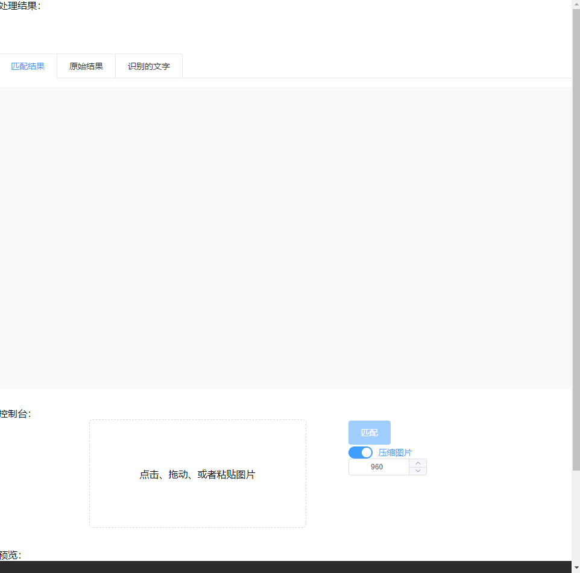

qa_ocr
===

对中文类问答题目进行 OCR，再将识别结果与题库进行匹配，得到一个最为相似的题目。

OCR 识别用到了 [DayBreak-u/chineseocr_lite](https://github.com/NewComer00/chinese-pdf-ocr)

题库匹配使用 [miohtama/python-Levenshtein](https://github.com/miohtama/python-Levenshtein)

## 环境

- python3.6
- linux/macos/windows

## 启动

```bash
python backend/main.py 
```

## 效果图



## 参考

- [chineseocr_lite](https://github.com/DayBreak-u/chineseocr_lite)
- [python-Levenshtein](https://github.com/miohtama/python-Levenshtein)
